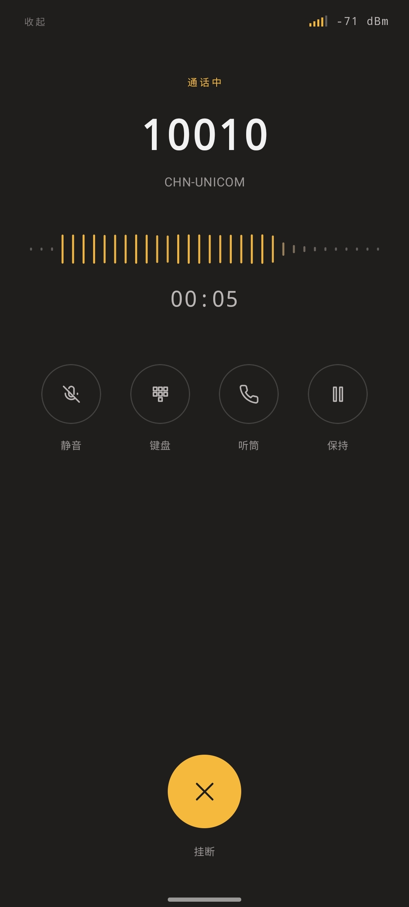
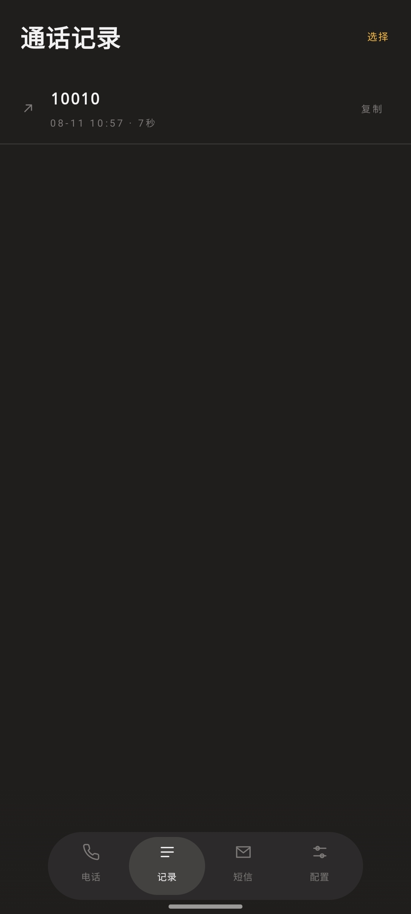
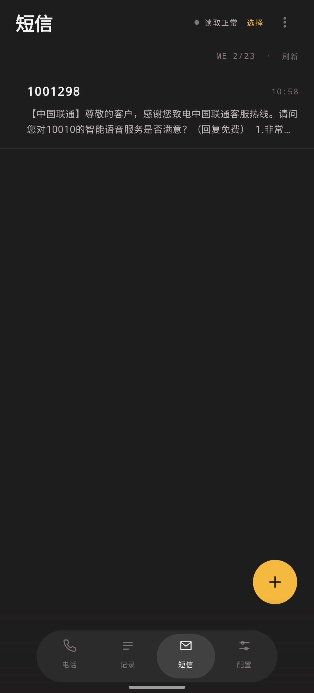
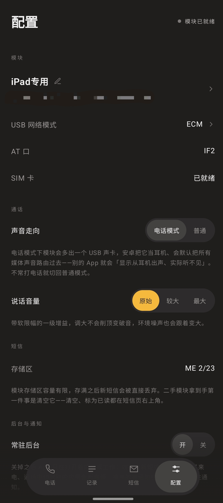

# CardDock

把 4G 模块插上安卓手机，用手机当它的**电话终端**、**短信终端**和**配置终端**。
不需要 root，不需要内核驱动，不需要背着电脑。

- **打电话、接来电** —— 用模块里的号码拨号、接听，来电全屏提示，自动记录通话历史
- **收发短信** —— 模块里的 SIM 卡不占手机卡槽，验证码自动提取、点击复制
- **切换 USB 网络模式** —— ECM / MBIM / QMI / RNDIS 现场切换，配好了再插到
  Mac、iPad 或 Windows 上当网卡
- **AT 控制台** —— 任意指令原样下发、原样回显，排查固件差异不用再开 Linux
- **链路诊断** —— 信号、运营商、注册状态、短信中心号码常驻显示

> 为兼容 DJI 增强图传模块（内核为 Quectel EG25-G）而写，同样适用于其他移远/高通平台模组。
> 本项目与 DJI、Quectel 均无任何关联，未获得也未寻求其授权或背书。

> **用途边界**
> 本项目面向个人用户管理自己名下实名 SIM 卡的短信与通话。
> 禁止用于代他人接收短信验证码、批量收发、或任何形式的远程/多卡服务。

---

## 2.3

- 新增「浅色」「深色」以及跟随系统的界面配色
- 对一部分机型进行了后台电话通知的优化
- 短信功能增加本地存储
- 新增 SIM 卡 PIN 码解锁与开关设置
- 优化了通话界面的逻辑
- 配置页排列更加简洁，对各类功能做了整合与归纳
- 其他一些功能性优化
- APP 基于三星 OneUI 8.5 机型测试，并对一部分国产机型兼容

---

## 2.0：四合一界面，新增通话

2.0 把界面重做成底部四个标签——**电话 / 通话记录 / 短信 / 配置**，导航栏悬浮在内容之上。

<table>
<tr>
<td width="25%" align="center">
<br>
<sub><b>通话中</b><br>静音 · 键盘 · 听筒/免提 · 保持</sub>
</td>
<td width="25%" align="center">
<br>
<sub><b>通话记录</b><br>本地保存，未接来电有徽标</sub>
</td>
<td width="25%" align="center">
<br>
<sub><b>短信</b><br>按号码聚合，多选删除</sub>
</td>
<td width="25%" align="center">
<br>
<sub><b>配置</b><br>模式切换、音量、后台开关</sub>
</td>
</tr>
</table>

- **电话** —— 拨号、接听；来电时全屏提示，锁屏也弹得出；通话中可静音、切换听筒 / 免提、
  开拨号键盘、保持通话；号码带运营商识别，通话自动进记录
- **短信** —— 同一号码的短信聚合成一个会话；支持多选删除、长按复制整条内容
- **USB 网络模式切换更快更稳**，插拔或换主机后也能自动认回模块
- **模块连接更可靠** —— 初始化与断线重连更稳定，读取短信不再偶发卡住
- **更多可调项** —— 配置页里可以开关常驻后台、调整通话说话音量、在电话 / 普通模式间切换

---

## 为什么不需要驱动

短信要走模块的 AT 命令口，而那几个接口是**厂商自定义类（`Cls=ff`）**，
不是标准 CDC-ACM。常规做法是靠内核的 `option` 驱动生成 `/dev/ttyUSB*`，
但手机 ROM 基本都没编译这个驱动，而且 `/dev/ttyUSB*` 权限是 `root:root`，
普通 App 读不到。

本项目改走 Android 的 **USB Host API**：App 直接 claim 接口做 bulk 读写，
完全绕开内核串口层。所以既不用 root，也不用刷内核。

---

## 功能

### 短信

- 读取模块存储区里的全部短信，中文自动 UCS2 解码
- 发送时按内容自动选编码：纯 ASCII 走 GSM（160 字符），含中文切 UCS2（70 字符）
- 新短信到达自动刷新（`+CMTI` 上报）
- 识别验证码类短信，单独显示大号数字，点击复制

### 存储区

状态栏下面一排按钮是模块支持的存储区，点一下切换：

- **ME** 模块内存，默认用这个
- **SM** SIM 卡，容量小，容易满
- **MT** 合并视图，部分固件支持

按钮上的数字是已用/总容量。**存满之后新短信会被直接丢弃，不会覆盖旧的**，
所以占用接近上限时界面会给红字提示。

删除：每条短信右下角对应 `AT+CMGD=<index>`；右上角「管理」里的「删除已读」
和「删除全部」对应 `AT+CMGD=1,1` 和 `AT+CMGD=1,4`，都有确认对话框。
部分固件不支持批量删除写法，报错时会提示逐条删。

### AT 控制台

- 直接下发任意 AT 指令，原样回显响应
- 内置常用查询快捷键（`QCFG="usbnet"`、`CSQ`、`CSCA?`、`CPMS?`、`CEREG?`、`ATI`）

### AT 口自动探测

切换 `usbnet` 之后 AT 串口的位置会变，社区里大量「模块变砖」的报告都源于此——
主机端写死了 `/dev/ttyUSB2`，换了接口就以为设备死了。

本项目不认死接口号，连接时分三级递进探测：

1. **快速**：每个带成对 bulk 端点的接口试一次 `AT`，命中即返回（正常一两秒完成）
2. **彻底**：多种指令变体（`AT\r\n` / `AT\r` / `ATI`）× DTR 拉高与拉低
3. **延迟重试**：等 5 秒再来一遍，应对模块刚重启尚未就绪

全部 USB 读写在后台线程执行，界面不阻塞，探测进度实时显示在状态行。

**这是相比 PC 端工具链的实际优势**：不依赖任何内核驱动、不需要 `new_id`，
插上手机就能把配置改回来。实测切到 RNDIS 后 AT 口移位，本 App 仍能自动找回。

### USB 接口一览

列出当前 USB 组合下模块暴露的全部接口——接口号、类/子类/协议、端点数量与方向，
并标注每个接口的推测角色（厂商自定义串口、CDC 控制/数据、RNDIS、UAC 等），
高亮当前正在使用的那个。

切换模式后想确认「到底还剩几个接口、AT 口跑哪去了」，看这里就够了。

### 配置备份

首次连接某颗模块时自动读取并保存 `AT+QCFG="usbnet"` 与 `AT+QCFG="usbcfg"` 的
原始返回，存在本地。USB 模式面板里显示备份内容并提供一键恢复。

**恢复点只在首次连接某颗模块时自动保存，之后不会自动更新**——否则切换模式后
就丢失了原始配置的记录，备份也就失去意义。想把当前配置设为新的恢复点，
用面板里的「以当前配置覆盖」。

**按 IMEI 分别存储。** 同型号模块的 VID/PID 完全相同，只有 IMEI 唯一，
不按 IMEI 区分就会把 A 模块的配置恢复到 B 模块上。面板顶部显示当前模块的
型号与 IMEI 后六位；若备份归属于另一颗模块会明确标红提示。

IMEI 通过 `AT+CGSN` 从模块读取，与手机自身的 IMEI 无关，**不需要任何
安卓权限**，也只保存在本地。

### 链路诊断

顶部常驻遥测行：信号格、运营商、dBm、当前 USB 模式、AT 口接口号、应用版本。
未注册到网络或短信中心号码为空时整行变红——发送失败的两大主因，一眼可见。

---

## 四种模式深入对比

选哪个模式，「免不免驱」只是最表层的判断。真正影响使用的是**谁负责拨号**、
**主机拿到什么 IP**、以及**链路怎么封装**。

| | QMI / RMNET | ECM | MBIM | RNDIS |
|---|---|---|---|---|
| USB 类 | 厂商私有 | USB-IF 标准 | USB-IF 标准 | 微软私有 |
| 谁拨号 | 主机 | **模块自己** | 主机 | 模块 |
| 主机拿到的 IP | 运营商真实 IP | 私网（模块 NAT） | 运营商真实 IP | 私网 |
| 链路封装 | raw-ip 或 802.3 | 802.3 以太帧 | **raw IP** | 802.3 以太帧 |
| 多 APN 并发 | 支持 | 只能一条 | 支持 | 只能一条 |
| 断线重连 | 主机负责 | **模块自己处理** | 主机负责 | 模块 |
| 控制通道 | QMI 二进制 | 无，仍需 AT | MBIM | 无 |
| macOS / iPadOS | ✗ | **免驱** | ✗ | ✗ |
| Windows | 需驱动 | 需驱动 | **免驱** | 免驱 |
| Linux | 免驱 | 免驱 | 免驱 | 免驱（已弃用） |

### ECM：最省心，代价是双层 NAT

ECM 模式下模块本身就是一台路由器。它自己完成拨号、持有运营商分配的真实 IP，
再通过内部 DHCP 给主机发一个私网地址——移远模组通常是 `192.168.225.x`，
网关会显示为 `mobileap.qualcomm`。

这带来一个容易被忽视的**真实优势**：连接控制权在模块手里，运营商侧断线时
模块会自行重建连接，主机完全不用管。无人值守场景下比主机拨号更稳。

代价也很明确：

- 主机看不到运营商真实 IP，**入站连接和端口映射做不了**
- 多一层 NAT
- 只能有一条数据连接，无法多 APN
- 802.3 封装每个 IP 包都要套以太网帧头，有额外开销

### MBIM：技术上最优的组合

MBIM 是 USB-IF 标准类，设计目标就是在单个 USB 接口上承载多条 IP 连接，
且**不需要 802.3 帧**——IP 包直接走 USB，省掉以太网头，也不需要 ARP。
配合 NTB 聚合（多个 IP 包塞进一条 USB 传输），吞吐和 CPU 占用都优于 ECM。

主机拨号、拿真实 IP、支持多 APN，Windows 8 以上原生识别为蜂窝网卡。
Linux 用 `cdc_mbim` + `mbimcli`。

**唯一短板是 macOS / iPadOS 完全不支持。**

### QMI：生态最成熟，但有个经典坑

QMI 是高通的私有控制协议，不只是网络协议。能力最全——SMS、SIM、信号、
多 PDN 都能通过二进制协议操作，ModemManager 在有 QMI 时会优先用它而不是 AT。

**坑在 raw-ip 与 802.3 的不匹配。** QMI 设备传统上默认模拟以太网设备，
但 MDM9x30 之后的固件已经**彻底放弃 802.3**。而驱动无法得知固件实际协商出的
模式——这个配置完全由用户空间的 QMI 管理程序决定。

典型症状是 `wwan0` 起来了但不通，需要手动指定：

```bash
echo Y > /sys/class/net/wwan0/qmi/raw_ip
```

另一个限制是吞吐：一个 URB 只承载一个 IP 包，高速传输时中断频繁、主机 CPU
吃紧，需要启用 QMAP 聚合协议缓解。

值得一提的是，OpenWrt / 软路由圈子的实测口径反而认为 **QMI 是最可靠的模式**，
比 MBIM 和 NCM 都稳。理论最优和工程最稳不是一回事——MBIM 协议更先进，
但 QMI 生态（`uqmi`、`libqmi`）打磨了十几年。

### RNDIS：遗留兼容模式

微软私有协议，只在 Windows XP / 7 这类没有 MBIM 支持的老系统上有意义，
且 Linux 的 `rndis_host` 已被标记弃用。

切换后 AT 串口会换到别的接口——社区里大量「模块变砖」的报告，实际是主机端
写死了原来的串口号（如 `/dev/ttyUSB2`），换个口就能通。**已实测**：切到
RNDIS 后本 App 仍能自动找到 AT 口，正常读写短信与切回其他模式。

### 选择建议

| 场景 | 选 |
|---|---|
| Mac / iPad 当网卡 | **ECM** |
| Windows 且不想装驱动 | **MBIM** |
| 软路由 / 树莓派做 4G 网关 | **QMI** |
| 需要多 APN 或入站连接 | QMI 或 MBIM |
| 无人值守、要求断线自愈 | **ECM** |
| 接 Windows XP / 7 老设备 | RNDIS |

### 关于安卓上的联网

**在未 root 的安卓上，任何 usbnet 模式都无法用于联网**，这不是模块或本项目的限制。

Android 的 `EthernetTracker` 只接管名字匹配 `config_ethernet_iface_regex` 的接口，
默认值为 `eth\d`。而 Linux 的 `cdc_ether`、`rndis_host`、`cdc_ncm` 都基于 usbnet
框架，创建的接口一律命名为 `usbX`，不匹配该正则，直接被系统忽略。ECM 和 RNDIS
在这一点上没有区别。

**但这不影响本项目**：短信走的是 AT 命令接口，四种 usbnet 模式下都存在。
模块插在安卓手机上的定位是**短信收发终端和配置终端，而不是网卡**。

---

## 硬件要求

- 支持 USB OTG 的 Android 8.0+ 设备
- Quectel EG25-G 或兼容的移远 LTE 模组
- **带外部供电的 OTG 转接头（必需，不是可选项）**

模块发射瞬时电流可达 1.5 A 以上，而手机 OTG 通常只提供 500 mA。
直插的典型表现是能识别、发几条指令后掉线，很容易误判成软件问题。
必须用带 PD 供电直通的转接头，让模块吃外部电源。

---

## 编译

### GitHub Actions

推送到仓库即自动构建，在 Actions 页面的 Artifacts 下载 APK。
打 tag（`v*`）会额外创建 Release 并附上 APK。

### 本地

```bash
gradle assembleDebug        # 调试包
gradle assembleRelease      # 正式包
```

产物在 `app/build/outputs/apk/`。环境：JDK 17、Android SDK 35、Gradle 8.9+。

### 正式签名（可选）

不配签名密钥也能编出 release 包，会退回调试证书——可以安装，但**每次构建
签名都不同，无法覆盖升级**。要正式分发就生成一个自己的密钥：

```bash
keytool -genkeypair -v \
  -keystore release.jks -alias release \
  -keyalg RSA -keysize 2048 -validity 10000
```

本地构建：在项目根目录建 `keystore.properties`（已在 .gitignore 中）：

```properties
storeFile=/absolute/path/to/release.jks
storePassword=...
keyAlias=release
keyPassword=...
```

CI 构建：把密钥转成 base64 存进仓库 Secrets：

```bash
base64 -w0 release.jks          # macOS 用 base64 -i release.jks
```

在 Settings → Secrets and variables → Actions 添加四项：
`KEYSTORE_BASE64`、`KEYSTORE_PASSWORD`、`KEY_ALIAS`、`KEY_PASSWORD`。

**密钥文件和密码务必自己备份。** 丢了就无法为已发布的应用推送升级。

### 发布

```bash
git tag v1.0.0
git push origin v1.0.0
```

版本号取自 tag（去掉前缀 `v`），versionCode 用 CI 运行序号。

---

## 适配其他模块

`Modem.kt` 顶部的常量按需修改：

```kotlin
const val VENDOR_ID = 0x2CA3          // 移远标准 ID 为 0x2C7C
const val PRODUCT_ID = 0x4006         // 对应 0x0125
const val AT_INTERFACE_HINT = 2       // 优先尝试的接口号，失败会自动遍历
```

同时更新 [`res/xml/device_filter.xml`](app/src/main/res/xml/device_filter.xml)，
注意其中的 vendor-id / product-id **必须写十进制**。改了才会在插入时自动弹出
打开提示；不改也能用，手动点连接即可。

---

## 已知限制

- **退到后台收不到新短信推送。** Android 会挂起进程，USB 读取线程停止。
  重新打开时靠 `AT+CMGL` 重新拉取。需要常驻得加前台服务。
- **短信只存在模块里**，拔掉模块就看不到历史。本地归档未实现。
- **长短信不分片。** 超过单条上限会被截断；接收的长短信在文本模式下会拆成多条。
  正确处理需要转 PDU 模式解析 UDH。
- 写入/发送存储区固定用 `ME`，只有读取区跟随界面切换。
- 通话功能未实现。呼叫控制（`ATD`/`ATA`/`ATH`）很简单，但音频需要
  Voice over USB 或 UAC 通路，工作量大得多。
- 自动探测只能处理「AT 口移位」这一类问题。如果用 `AT+QCFG="usbcfg",...,0,0,0,0,0,0,0`
  关闭了全部 USB 功能，或用了 `usbauto` 导致只枚举 RNDIS，那就没有任何通道了，
  必须接电脑走 EDL（9008）刷机。**本 App 不会主动写这两个参数。**

欢迎 PR。

---

## 排查

发送失败先确认这几项，在 App 的遥测行或 AT 控制台都能看：

```
AT+CSCA?     短信中心号码，为空则发不出去
AT+CEREG?    第二个数为 1 或 5 才算注册上网络
AT+CPIN?     应返回 READY
AT+CPMS?     各存储区占用
```

App 显示「没找到模块」时，先排除供电问题再怀疑代码。

---

## 免责声明

本项目仅供学习和个人使用。使用者需自行确保：

- 对所操作的硬件拥有合法处置权
- SIM 卡的使用符合运营商条款及所在地法律法规
- 不将本工具用于代他人接收短信验证码、批量收发、远程/多卡服务或任何违法用途

修改模块 NV 配置存在使设备无法正常工作的风险，**操作前请备份原始配置**
（用 AT 控制台执行 `AT+QCFG="usbnet"` 和 `AT+QCFG="usbcfg"` 并记录返回值）。
作者不对任何硬件损坏、数据丢失或法律后果承担责任。

## 许可

[MIT](LICENSE)
